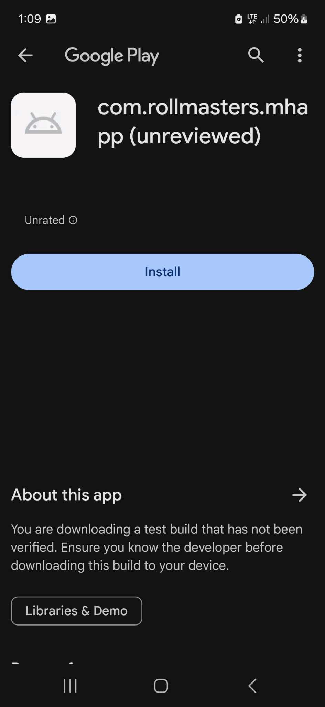
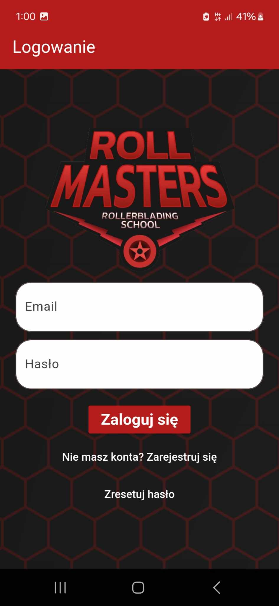
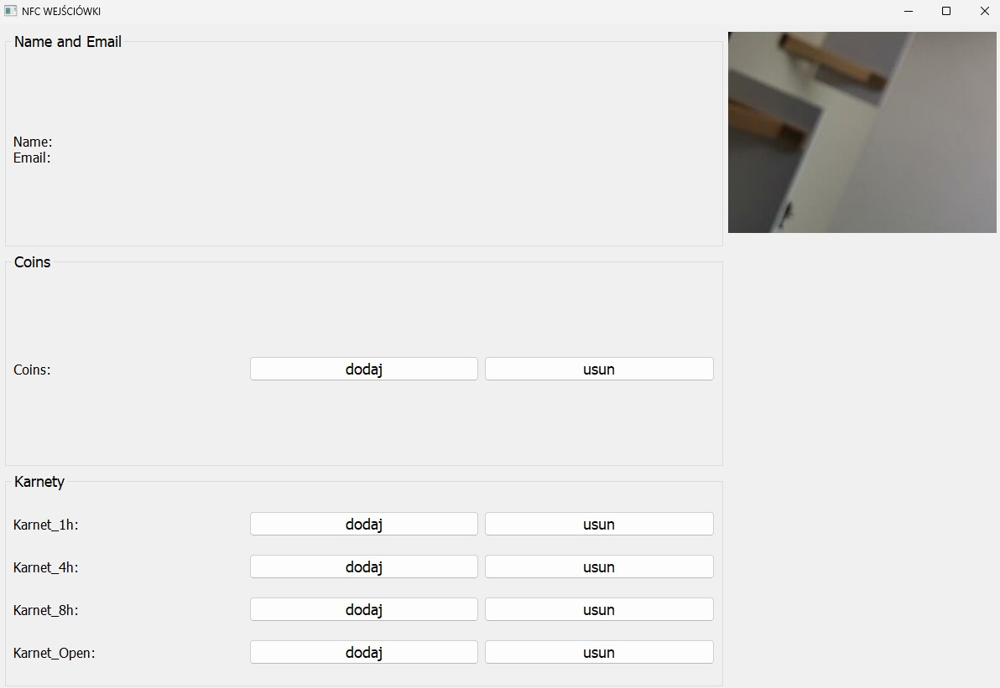

# Aplikacja mobilna do zakupu wejściówek i karnetów
Aplikacja mobilna umożliwiająca zakup wejściówek na skatepark oraz karnetów na zajęcia wykorzystująca funkcję NFC oraz kody QR do sprawdzania i potwierdzania wejść.
Drugą częścią projektu jest aplikacja na komputer pokazująca informacje o zakupionych wejściach oraz karnetach.
## Instalacja aplikacji mobilnej
Aplikacja dostępna jest do pobrania ze sklepu Play pod poniższym linkiem. Dostęp do pobrania dostępny jest po zalogowaniu się na telefonie z Androidem na konto Google znajdujące się na whiteliście.

https://play.google.com/apps/internaltest/4699800244431756184

Po kliknięciu przycisku instalacji aplikacja jest gotowa do użycia.
## Logowanie do aplikacji
Po uruchomieniu aplikacji 'RollMasters' pojawia się ekran logowania.

W celu utworzenia konta należy nacisnąć napis "Zarejestruj się", podać swoje dane oraz potwierdzić adres e-mail. Po założeniu konta można zalogować się i w pełni korzystac z funkcji aplikacji.
## Instalacja aplikacji na komputer
Aby w pełni korzystać z aplikacji desktopowej konieczne jest posiadanie czytnika ACR122u oraz dostępu do kamery internetowej lub podłączenia smartphona jako kamery. Do korzystania z czytnika konieczne są sterowniki ze strony producenta (http://www.acs.com.hk/download-driver-unified/9840/ACS-Unified-MSI-4280.rar). Po podłączeniu kamery oraz czytnika należy pobrać folder https://drive.google.com/file/d/1TvuesFbxGW98fiMhukr1yJWfDl_9GTkr/view?usp=sharing z dysku. Po wypakowaniu i otwarciu folderu należy uruchomić plik Rollmasters_app.exe. Po poprawnym uruchomieniu aplikacji otwiera się główne okno aplikacji.

